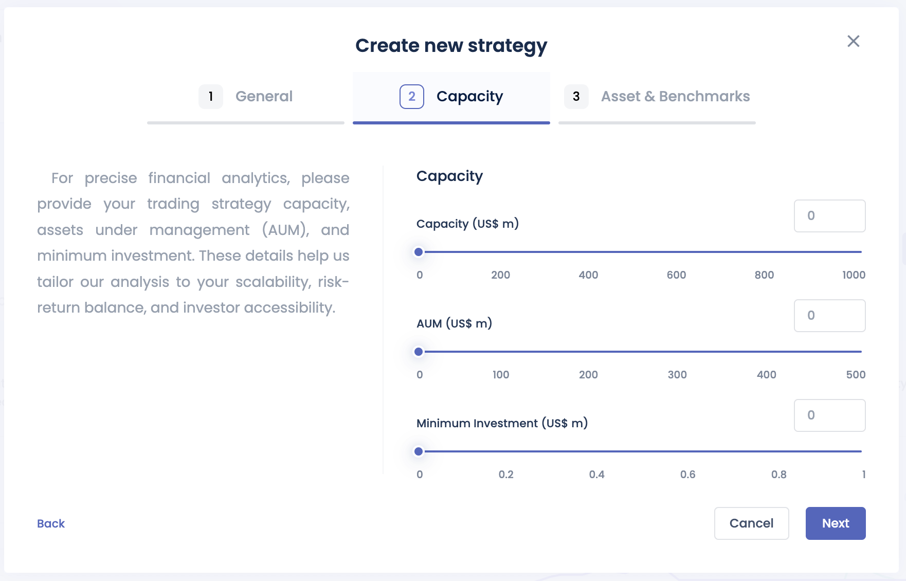

# Alpha Partner's Portal

The Alpha Partner's Portal is designed primarily for alpha partners to introduce new strategies or monitor existing strategies if they are live. It provides a view of various performance metrics, live positions, and capital allocations. Additionally, it allows the generation of two types of factsheets: a one-page factsheet and a full analysis factsheet.

# Add New Strategy

