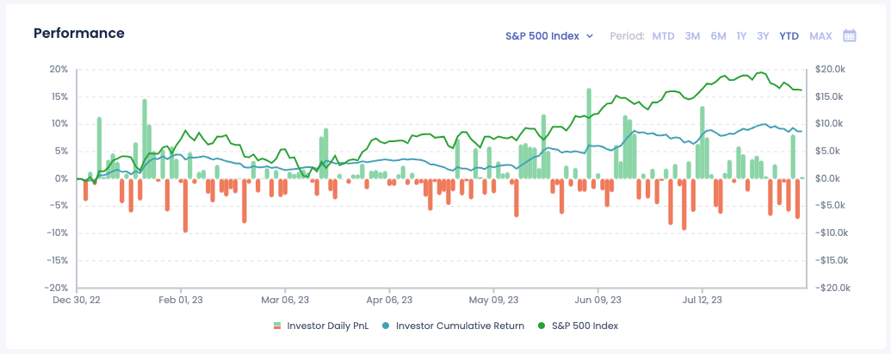
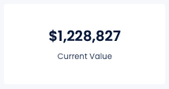
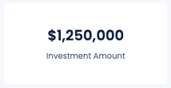
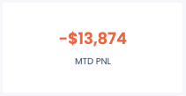
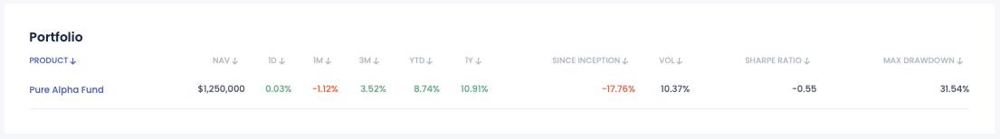
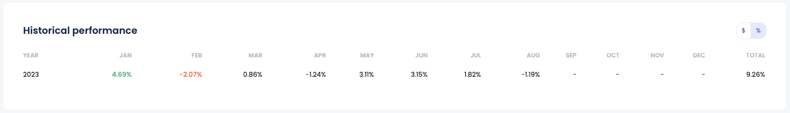
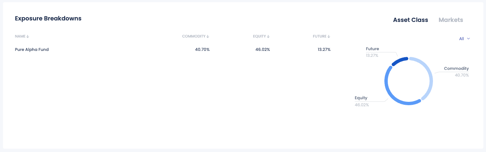

# Dashboard

## Performance chart

The Performance Chart displays the historical performance of an investor’s portfolio over various time frames. Key functionalities include:

- Customizable time frames: MTD, 3M, 6M, 1Y, 3Y, YTD, MAX, and Custom Range.
- Tooltips for precise performance metrics on hover.
- Ability to select benchmarks for performance comparison.

## Current Value

The Current Value section provides real-time updates on the total value of the investor’s portfolio. 

## Investment Amount

Details the total amount invested in the portfolio, including:

- Initial investment and additional contributions.
- Withdrawals and their impact on the portfolio value.
- Net investment after considering withdrawals and contributions.

## MTD PnL

The Month-to-Date Profit and Loss (PnL) section provides insights into the portfolio’s performance for the current month.

## Portfolio

The Portfolio section provides detailed information on the products invested into, including:

- **NAV (Net Asset Value)**: The value of the portfolio’s assets minus its liabilities.
- **1D, 1M, 3M, YTD, 1Y, Since Inception**: Performance metrics over different time frames.
- **VOL (Volatility)**: The degree of variation of the portfolio's returns over time.
- **Sharpe Ratio**: A measure of risk-adjusted return.
- **Max Drawdown**: The maximum observed loss from a peak to a trough.

## Historical Performance table

The Historical Performance table provides a comprehensive view of the portfolio’s performance on a monthly and yearly basis. Key functionalities include:

- **Monthly Performance**: Displays the historical performance of the portfolio for each month.
- **Yearly Performance**: Summarizes the total performance for each year.
- **Toggle Returns**: Users can toggle between viewing returns in dollars ($) and percentages (%).

This section allows investors to easily track and analyze the historical returns of their portfolios, offering insights into monthly and yearly trends.

## Exposure Breakdowns

The Exposure Breakdowns section of the FundBox dashboard provides a detailed analysis of the portfolio's exposure across different asset classes and markets. This section helps investors understand the distribution of their investments and assess the risk associated with their portfolio. Key features of the Exposure Breakdowns section include:

- **Asset Class Distribution**: A visual representation of the portfolio’s allocation across various asset classes such as Commodities, Equities, and Futures.
- **Breakdown by Name**: A table listing each fund or product in the portfolio, showing the percentage allocation to each asset class.
- **Interactive Pie Chart**: A pie chart that visually depicts the proportion of the portfolio invested in each asset class, providing a quick and clear understanding of the portfolio's composition.
- **Toggle Views**: The ability to switch between different views, such as Asset Class and Markets, to gain insights from different perspectives.
- **Sortable Columns**: Columns in the table can be sorted to quickly identify the largest or smallest exposures in each category.

