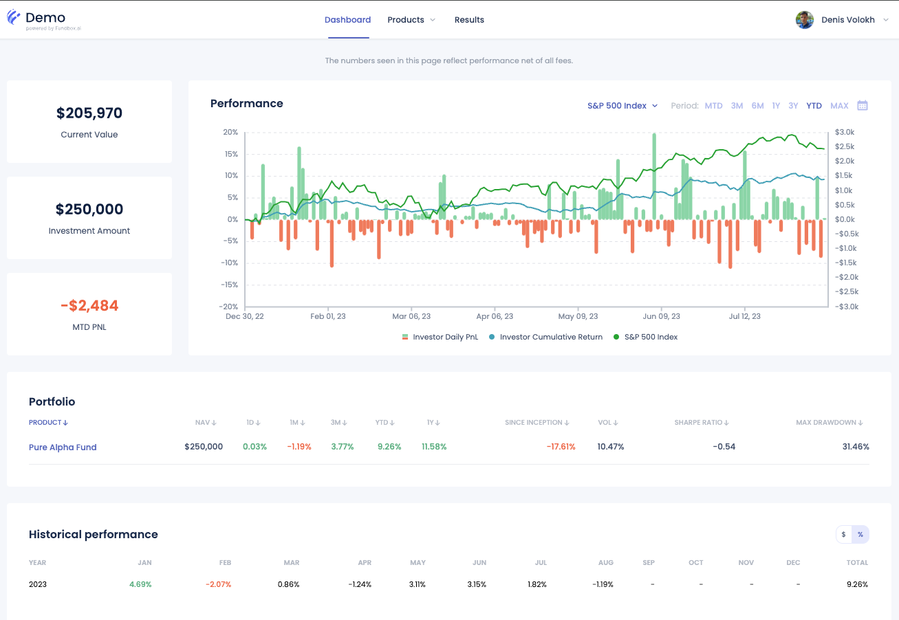

# Investor's Portal

FundBox is an advanced platform designed to offer accredited investors comprehensive access to their investment portfolios. This documentation provides detailed information on the features and functionalities of the FundBox solution, including performance charts, portfolio insights, current value, investment amount, month-to-date PnL, historical performance, and exposure breakdowns.

