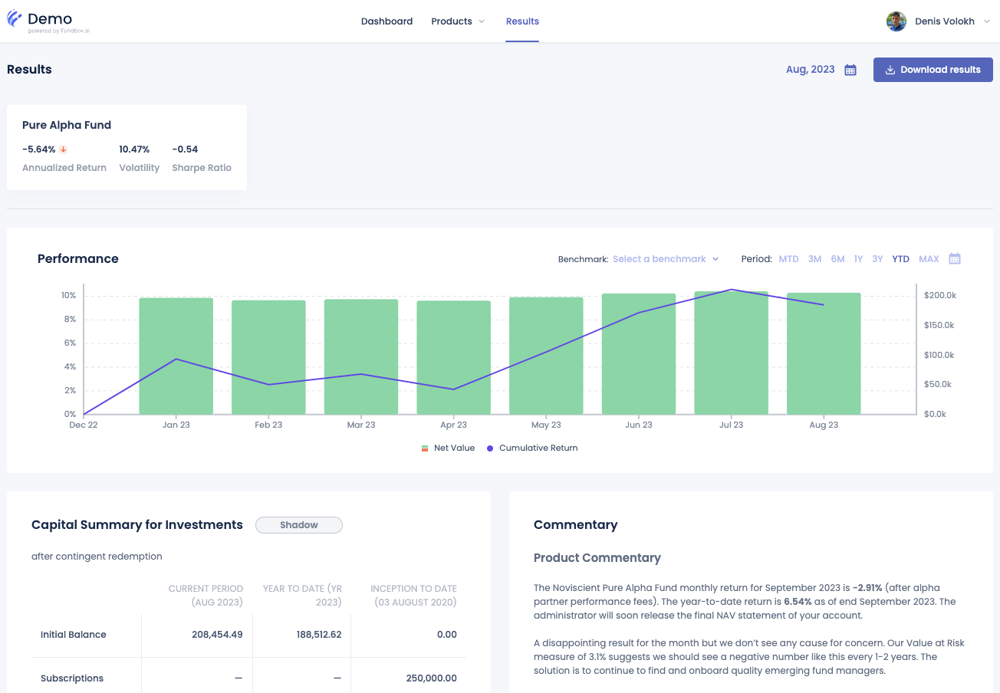
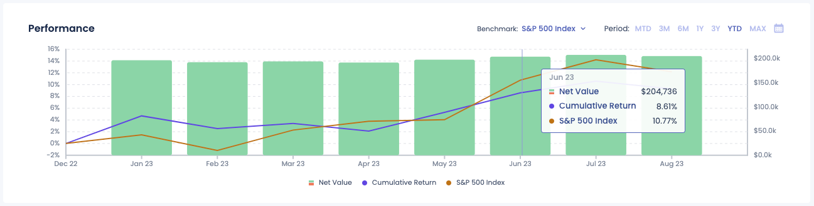
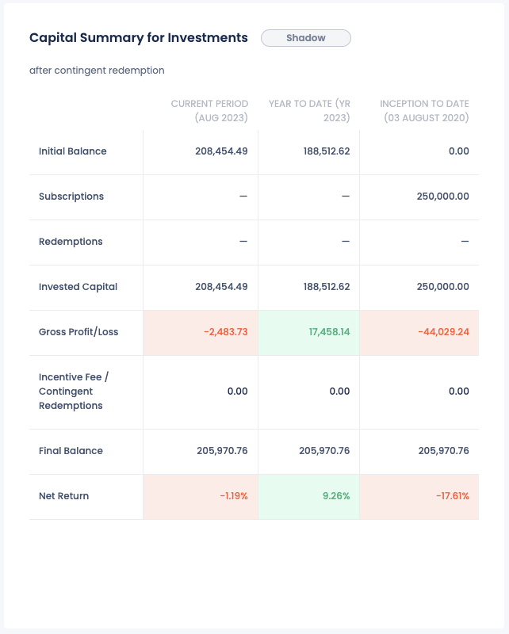

# Results

The Results page on the FundBox platform provides a detailed view of an investor’s portfolio performance, capital summary, and insightful commentaries. This documentation outlines each section of the Results page.

## Performance chart

The Performance Chart section allows investors to analyze their portfolio performance over various time frames. Key functionalities include:

- A visual graph showing Net Value and Cumulative Return.
- Options to select time frames such as MTD, 3M, 6M, 1Y, 3Y, YTD, and MAX.
- A benchmark selection feature for performance comparison.
- Interactive elements to hover over data points for detailed metrics.

## Capital Summary for Investments

The Capital Summary section provides a detailed breakdown of the investment's financial performance over different periods. It includes:

- The value of the portfolio in the current period.
- Year-to-date performance, showing gains or losses since the beginning of the year.
- Inception to date metrics, providing an overview since the start of the investments.
- Detailed metrics such as Initial Balance, Subscriptions, and Redemptions.

## Product Commentary

The Product Commentary section offers a list of detailed insights and updates from Alpha Partners.

