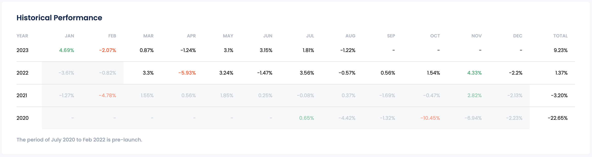

# Dashboard

The Manager's Dashboard for a selected product provides a detailed and organized view of the product's key metrics and information. It includes the following tabs:

- **Performance**: Offers insights into the product's performance, including net asset value, return rates, and profit and loss data.
- **Strategies**: Details the investment strategies associated with the product, outlines the historical performance of these strategies, and includes information on alpha partners' fees and expenses.
- **Risk**: Provides a comprehensive analysis of the product's risk metrics, including factor exposure, volatility, drawdown, and other risk-adjusted performance measures.
- **Capital**: Displays Total AUM over time, Margin Usage, and Allocations to Strategies.
- **Files**: Houses important documents and files related to the product, ensuring easy access to necessary information and reports.

These tabs collectively give a thorough overview of the selected product, aiding the manager in making informed decisions and effectively managing the investment.

## Performance

### Fund Level Risk Metrics

Displays key performance indicators and risk metrics for the fund, such as net asset value, returns, and volatility.

(../images/managers-dashboard-fund-level-risks.png)

### Net Daily & Cumulative PnL chart

Contains a chart showing the daily and cumulative profit and loss over time, with options to select different periods for analysis.

### Historical Performance table

Shows a table of the fund's monthly performance over several years, allowing for a detailed view of historical returns.

### Return and Risk Statistics (Annualized)

Provides annualized statistics, including various return rates, performance metrics over different time frames, and measures of volatility, drawdown, and ratios that assess risk-adjusted performance.

