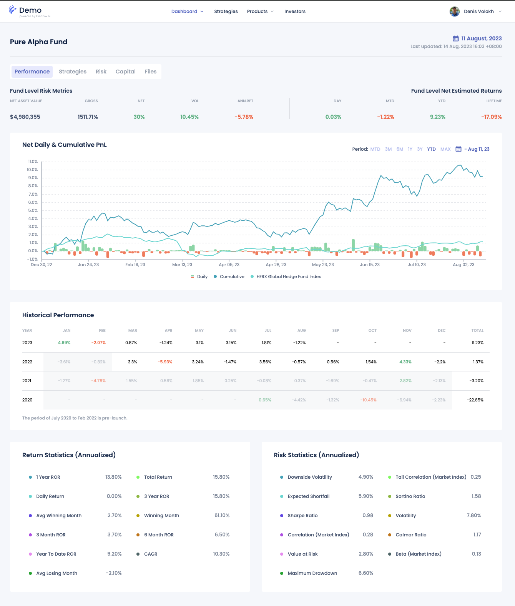

# Manager's Portal

The Manager's Portal provides a comprehensive overview of various investment products' performance and risk metrics. It includes key sections such as Fund Level Risk Metrics, Net Daily & Cumulative PnL, Historical Performance, Return Statistics (Annualized), and Risk Statistics (Annualized). Each section offers detailed insights into the current status, historical returns, and risk-adjusted performance of the investment products, helping the fund manager make informed decisions. The main menu allows easy navigation to other sections like Dashboard, Products, Strategies, and Investors.

The Manager's Portal is the primary interface for fund managers to manage and analyze their investment products. Key sections include:

- **Dashboard**: Provides an overview of sleected product performance and key metrics.
- **Products**: A menu where investors can explore available products for investment, including detailed descriptions and performance metrics for each product.
- **Strategies**: On the Strategies page, fund managers can access all available strategies and their performance metrics.
- **Investors**: The Investors page provides a view of all investors and their investments in the fund.
