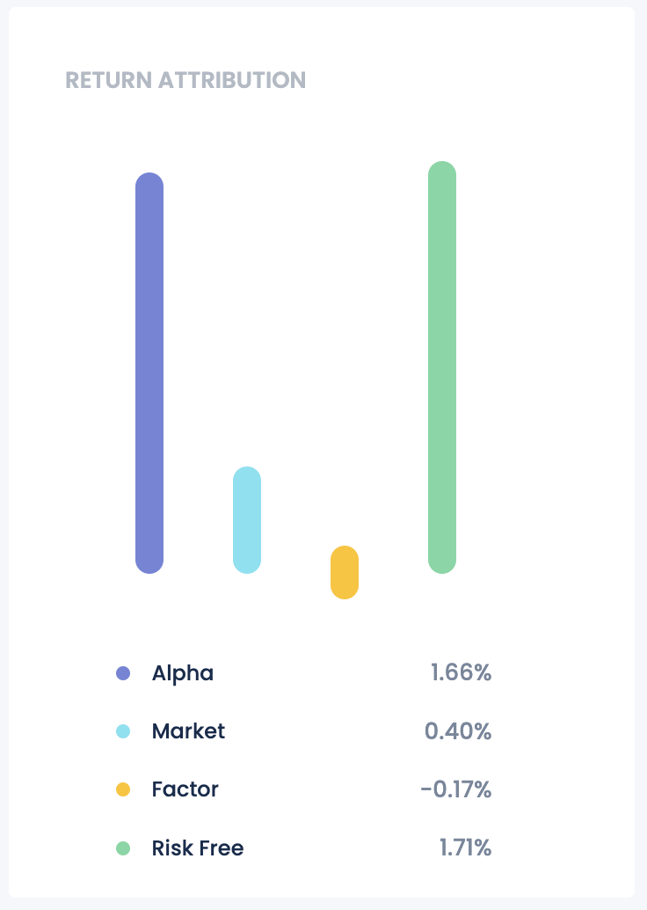

# Products

The Products section of the FundBox Manager Portal allows managers to explore a wide range of available investment products. This section provides comprehensive details and performance metrics for each product, enabling managers to make informed decisions.

Key Features:

- **Performance Overview**: Get a quick overview of each product's performance, including key metrics like returns, volatility, and drawdown. This snapshot helps in preliminary comparisons and assessments.

- **Performance Matrics**: Access detailed performance metrics for each product, such as Sharpe ratio, Sortino ratio, and maximum drawdown. These metrics provide a deeper understanding of the product's risk-adjusted performance.

- **Product Components**: View the strategies and assets that make up each product, along with their respective allocations and performance metrics. This feature allows managers to assess the composition and performance of the product's underlying components.

- **Dynamic Allocation**: Explore the dynamic allocation of capital within each product, including changes over time and the strategies receiving the highest allocations. This information aids in understanding the product's investment strategy and allocation decisions.

- **Factor Exposure**: Analyze the factor exposure of each product, including key risk factors and their impact on performance. This feature provides insights into the product's risk profile and helps in assessing potential risks.

## Performance chart

The Performance chart displays the historical performance of the product, incuding benchmarks and key performance metrics. Users can select different time periods for analysis and compare the product's performance against relevant benchmarks.

## Return Attribution chart

The Return Attribution chart breaks down the product's returns into various components, such as alpha, market, Factor and Risk Free returns. This detailed analysis helps in understanding the sources of the product's performance and identifying areas for improvement.

## Decomposition charts

The Market and Asset Class Decomposition charts provide underlying details on the product's exposure to different markets and asset classes, respectively. These charts offer insights into the product's diversification and risk profile.

## Worst Months chart

The Worst Months chart highlights the product's performance during its worst months, allowing users to assess the impact of market downturns and drawdowns. This information helps in evaluating the product's resilience and risk management.

## Performance and Risk Metrics table

The Performance and Risk Metrics table summarizes key performance and risk metrics for the product, including Sharpe ratio, Sortino ratio, maximum drawdown, and other risk-adjusted performance measures. This table provides a comprehensive view of the product's historical performance and risk profile.

## Product Components table

The Product Components table lists the strategies that make up the product, along with their respective allocations and performance metrics. This table offers a detailed view of the product's composition and underlying components, aiding in performance analysis and decision-making.

## Dynamic Allocation chart

The Dynamic Allocation chart displays the changes in capital allocation within the product over time, highlighting the strategies receiving the highest allocations. This chart provides insights into the product's investment strategy and allocation decisions, aiding in understanding the product's performance.

## Factor Exposure charts

To be added