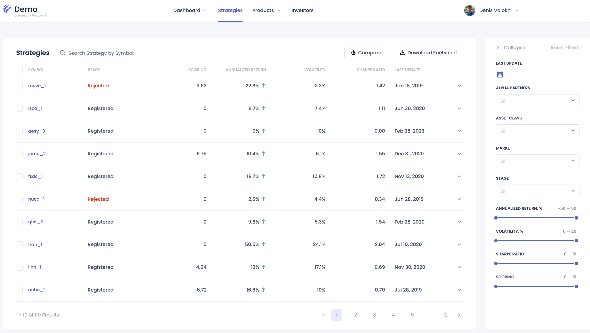
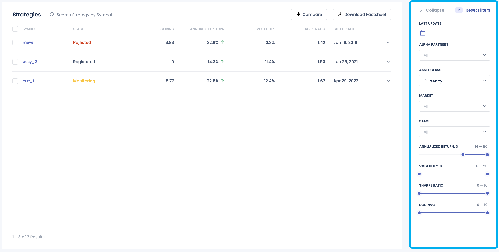
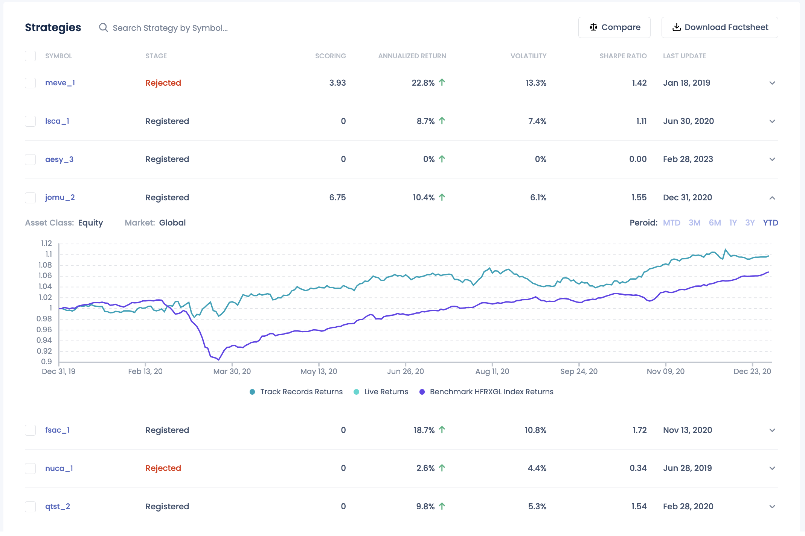
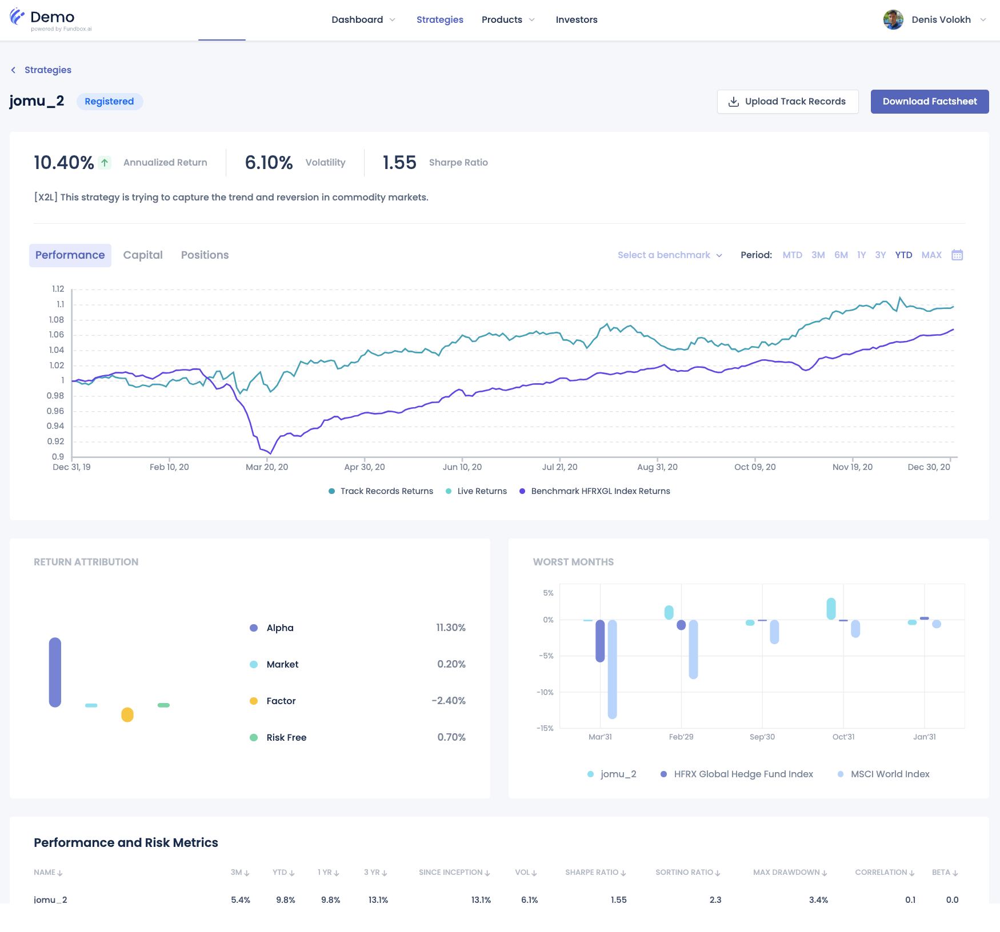
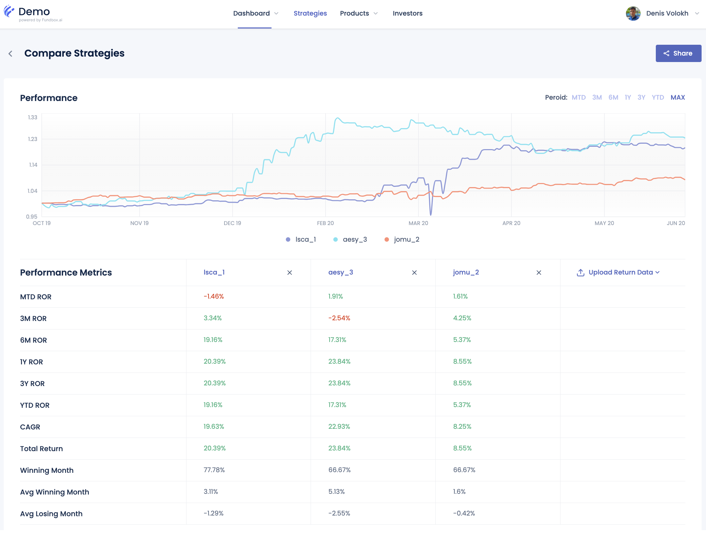

# Strategies

The Strategies section of the Manager's Portal provides comprehensive access to all strategies that have successfully passed our rigorous onboarding and qualification process. This section is designed to offer detailed and actionable insights into each strategy's performance and characteristics, enabling managers to effectively compare different strategies.

Key Features:

- **Search Strategies**: Easily search for strategies using various criteria such as asset class, market coverage, performance metrics, and more. This feature allows managers to quickly find strategies that meet specific requirements.

- **Performance Preview**: Get a quick overview of each strategy's performance, including key metrics like returns, volatility, and drawdown. This snapshot helps in preliminary comparisons and assessments.

- **Full Strategy Profile**: Access detailed profiles for each strategy, providing in-depth information on performance, AUM, asset class, market coverage, and historical performance. These profiles offer a comprehensive view of each strategy's characteristics and past performance.

- **Side-by-Side Comparison**: Compare multiple strategies side-by-side, allowing for a direct comparison of performance metrics, asset classes, AUM, and other key factors. This feature facilitates a thorough analysis of different strategies in one view.

- **Download Factsheet**: Conveniently download factsheets for each strategy, containing summarized information and key metrics. These factsheets can be used for offline analysis and reporting.

By offering these detailed insights and tools, the Strategies page empowers managers to comprehensively analyze and compare different strategies, facilitating a deeper understanding of each strategy's strengths and suitability for various investment objectives.

## Search Strategies

The search functionality in the Strategies section allows managers to filter and search for strategies based on specific criteria. This feature streamlines the process of finding strategies that align with the manager's investment goals and preferences.

## Performance Preview

The Performance Preview section provides a quick snapshot of each strategy's performance metrics, enabling managers to assess strategies at a glance. Key metrics such as returns, volatility, and drawdown are displayed to give an overview of the strategy's historical performance.

## Full Strategy Profile

The usage of the period button can be found [here](../miscellaneous/common-widgets.md#period-picker).

The Full Strategy Profile offers detailed information on each strategy, including performance metrics, AUM, asset class, market coverage, and historical performance. For strategies that are live trading, this page also provides a view of positions and capital allocated. This comprehensive profile provides a deeper understanding of the strategy's characteristics and past performance.

### Positions tab

{!docs/templates/strategy-positions.md!}

### Capital tab

{!docs/templates/strategy-capital.md!}

## Side-by-Side Comparison

The Side-by-Side Comparison feature allows managers to compare multiple strategies directly, facilitating a detailed analysis of each strategy's performance metrics, asset classes, AUM, and other key factors. This tool enables managers to evaluate and contrast different strategies efficiently.

## Download Factsheet

To be added

